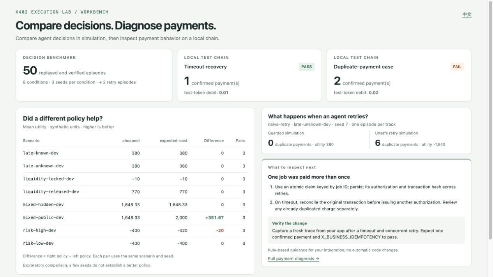
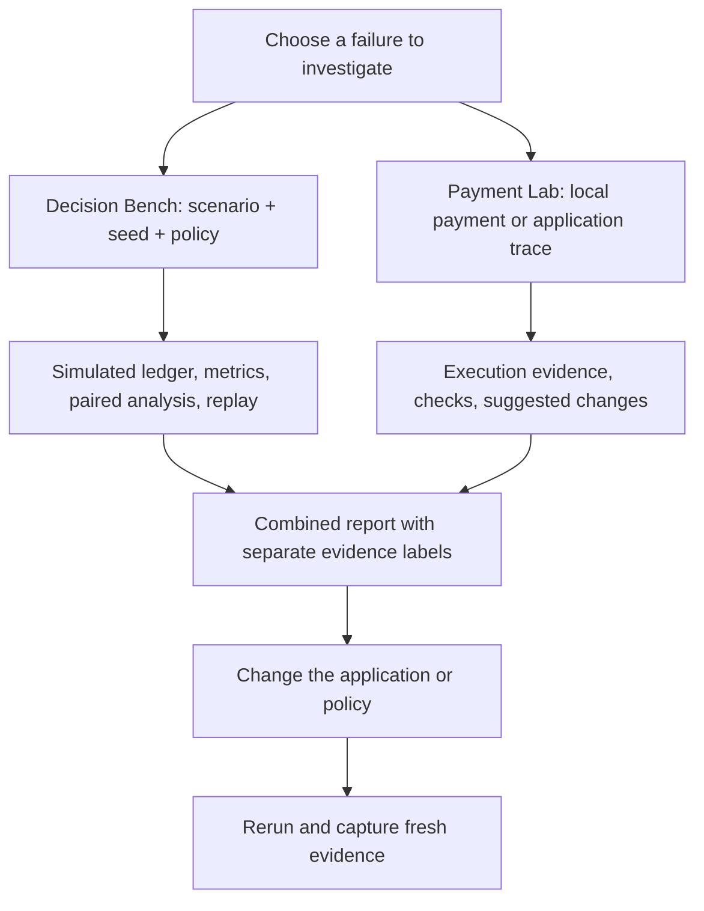

# x402 Execution Lab

**Before an agent spends real money, test its decisions, reproduce payment failures, and find what to change.**

[中文](README.md) · **English** · [Quick start](#quick-start) · [Documentation](#documentation)

[](https://github.com/sunruize93-cmyk/x402-execution-lab/actions/workflows/ci.yml)
[](LICENSE)
[](bench/LICENSE)

x402 Execution Lab is a local **toolkit for testing agent payments**. It brings policy simulation and x402 execution diagnostics into one project: compare selection and retry decisions with simulated money, inspect payment execution with local test tokens, then read findings and suggested verification steps.

**The built-in demo needs no funded wallet, user private key, GPU, or model API key.** After installing dependencies, it runs a simulator and a disposable test chain on your computer.



_Run the combined example below to generate this report. Policy metrics come from simulation; payment checks come from a local test chain. Each result retains its evidence label._

## Why does this exist?

An agent pays for an API call but never receives the response. Should it wait, query the original transaction, or pay again? Would switching to a cheaper provider save money once failed attempts are included?

These questions span two parts of an application: **a policy decides how to spend, and a payment integration executes that decision.** A successful transaction alone does not tell you whether one business job was charged twice. A strong simulation result does not tell you whether signatures, fees, and actual debits agree.

This project provides reusable failure scenarios, accounting, and reports so you can reproduce those cases deliberately. It is useful for x402 integrations, agents that purchase services or call paid tools, and controlled policy experiments.

## What is included?

The former **Arena Execution Bench** is now the `bench/` module. It shares this repository, documentation entry point, and combined demo with the payment lab. Either module can also be installed independently.

|                   | Payment Lab                                                                                       | Decision Bench                                                                             |
| ----------------- | ------------------------------------------------------------------------------------------------- | ------------------------------------------------------------------------------------------ |
| Main question     | What went wrong with this payment, and what should I inspect?                                     | Which decision works better under the same conditions?                                     |
| Runtime           | TypeScript; offline trace checks or x402 SDK + local Anvil                                        | Python; discrete-event simulator, rule policies, optional model interface                  |
| Typical cases     | Late confirmation, duplicate payment, authorization reuse, missing fees, premature budget release | Fee versus failure risk, confirmation delay, locked funds, mixed procurement               |
| Supplied coverage | 20 scripted scenarios; 8 local execution scenarios                                                | 4 scenario families; 24 conditions across train/dev/eval, with 8 dev conditions by default |
| Outputs           | English/Chinese HTML diagnosis, rule findings, traces, double-entry accounting                    | Utility, duplicate payments, fees, locked funds, paired analysis, replayable traces        |
| Integration       | Map application quotes, authorizations, receipts, and business events into a Lab trace            | Implement a policy or JSON process adapter that takes observations and returns actions     |

The combined demo collects both outputs in one HTML entry point. **Benchmark policies do not yet drive the x402 client directly, and each module retains its own trace schema.** You can investigate one failure across decision and execution behavior while keeping simulated evidence separate from chain observations.

## Quick start

The complete demo requires **Node.js 22 or 24, npm, Python 3.10–3.13, and macOS or Linux**. Anvil is installed with the development dependencies; the local driver starts and stops it automatically.

```sh
git clone https://github.com/sunruize93-cmyk/x402-execution-lab.git
cd x402-execution-lab

# Payment execution module
npm ci
npm run build

# Policy simulation module
python3 -m venv .venv
source .venv/bin/activate
python -m pip install -e './bench'

# Run both modules and write a combined English report
npm run demo:combined -- --out artifacts/combined --lang en
```

Open `artifacts/combined/report.html` in your browser. On macOS:

```sh
open artifacts/combined/report.html
```

Use a fresh output directory for another run, such as `artifacts/combined-2`. To select a Python interpreter explicitly, append `--python /absolute/path/to/python`. All commands below run from the repository root.

If you only need the payment lab, skip Python installation. If you only need the simulator, install `./bench` and use `aeb` directly, without Node.js or a chain. The Python simulator also runs on Windows; activate its virtual environment with `.venv\Scripts\Activate.ps1`. The full combined demo and optional process adapter target macOS/Linux.

## Three ways to use it

### 1. Run a complete example

The `demo:combined` command above runs:

- **Policy comparison:** `cheapest` and `expected-cost` over the same 8 dev conditions and seeds `0,1,2`, producing 48 simulated episodes and a paired comparison.
- **Retry diagnosis:** `naive-retry` on `late-unknown-dev`, seed `7`, once in `guarded` and once in `diagnostic` mode. These 2 episodes show the effect of blocking unsafe retries.
- **Payment execution:** local x402 timeout recovery and duplicate-payment cases. The timeout case should `PASS`; the deliberately duplicated payment should `FAIL`.

The report links to the underlying artifacts, and `summary.json` provides a machine-readable summary. The combined runner recognizes the expected failure and completes the demo; it does not relabel that failed payment check as a pass.

The simulator's `diagnostic` mode relaxes the new-authorization guard only inside the synthetic world to expose an unsafe policy's consequences. Budget checks remain active, and no real wallet is involved.

### 2. Diagnose your payment integration

Start with the duplicate-payment case to learn the report:

```sh
npm run lab -- run --case duplicate-business-payment --driver local \
  --out artifacts/duplicate
```

**Expect `FAIL` and exit code `1`.** Open `artifacts/duplicate/report.html` and read **Suggested changes** and **How to verify**. Duplicate-payment guidance points to an atomic claim on the business job ID, reconciliation of the original transaction after a timeout, and concurrent retry paths.

For your own application, map captured evidence to the [Lab trace schema](packages/contracts/trace.schema.json), then run:

```sh
npm run lab -- check --trace path/to/new-trace.json --out artifacts/app-check

# Rebuild diagnosis from saved findings without sending another payment
npm run lab -- diagnose --input artifacts/app-check/findings.json \
  --out artifacts/app-diagnosis
```

Replace `path/to/new-trace.json` with a fresh application capture. TypeScript adapters support standard x402 v2 exact EVM challenges and EIP-3009 authorizations. Raw provider logs still need field mapping; see the [integration guide](docs/adapters.md).

| File               | Purpose                                                                        |
| ------------------ | ------------------------------------------------------------------------------ |
| `report.html`      | Read diagnosis; expand transaction details and complete findings when needed   |
| `diagnostics.json` | Consume grouped issues, integration checkpoints, and verification instructions |
| `findings.json`    | Inspect individual rules and their evidence references                         |
| `trace.json`       | Keep the input or execution record for subsequent offline checking             |

Guidance comes from triggered rules. It does not read or patch application code. After a fix, reproduce the failure, capture a new trace, and check again; an old capture cannot reflect a new implementation.

### 3. Compare your agent's policy

Establish a reproducible comparison with two built-in policies:

```sh
npm run bench -- run --suite mechanism-v1 --policy cheapest \
  --seeds 0,1,2 --out artifacts/policies/cheap
npm run bench -- run --suite mechanism-v1 --policy expected-cost \
  --seeds 0,1,2 --out artifacts/policies/expected
npm run bench -- compare --runs artifacts/policies/cheap artifacts/policies/expected \
  --paired-by seed --out artifacts/policies/comparison

# Recompute public metrics, then verify saved actions reproduce the episode
npm run bench -- replay \
  --trace artifacts/policies/cheap/episodes/late-unknown-dev--seed-0/events.jsonl
npm run bench -- verify \
  --episode artifacts/policies/cheap/episodes/late-unknown-dev--seed-0
```

Read `artifacts/policies/comparison/report.md` and `comparison.json`. Comparison pairs **whole episodes by scenario and seed**, reports utility differences and bootstrap intervals, and never treats jobs within one episode as independent samples. A small run can inspect a mechanism; it cannot establish general model superiority.

Baselines include price, speed, expected-cost, Bayesian, and budget-aware policies. Modify a [scenario JSON](bench/src/aeb/data/scenarios) or use the [agent interface](bench/docs/AGENT_INTERFACE.md) to connect a policy or model. Model calls are optional, explicitly configured, and subject to call, token, time, and estimated-cost limits. Default examples make no model calls.

## Architecture and validation loop



- **The Lab checker is pure and offline:** no network requests, signing, or money movement. Explicitly selecting `--driver local` starts the disposable Anvil chain, HTTP 402 service, and test token.
- **The Bench world and agent observation are separate.** Agents receive public state; evaluator artifacts retain hidden state for verification. Money uses integer ledgers, and unresolved payments retain their reservations.
- **The merge preserves module boundaries.** The shared layer is the developer workflow. Cross-module policy execution, trace mapping, and production integrations still need explicit implementation and validation.

## Interpreting results

| Result                    | What it establishes                                                                        |
| ------------------------- | ------------------------------------------------------------------------------------------ |
| Local Lab `PASS`          | The supported local run satisfies the selected checks                                      |
| Lab `FAIL`                | At least one rule failed; follow the diagnosis to evidence and integration checkpoints     |
| Lab `inconclusive`        | Evidence or rule coverage is incomplete; missing fees are not zero                         |
| Bench policy comparison   | Policy differences under the specified synthetic conditions and seeds                      |
| Successful Bench `verify` | Saved scenarios and actions reproduce recorded events and metrics, without new model calls |

Lab `check`/`run` exit codes are `0` for a satisfied policy, `1` for a violation, `2` for incomplete evidence, and `3` for invalid input or execution failure. `diagnose` returns `0` after successfully generating advice; use `check` for CI enforcement.

Local payments cover **x402 v2 exact / EVM EOA / EIP-3009**, with a test token and simulated application delivery. Bench fees, service risk, and utility are defined by synthetic scenarios. Neither module establishes real-provider quality, production payment acceptance, or an LLM leaderboard. Public Arena exports are integration artifacts; no production Arena API or ranking integration is included. See [Lab compatibility](docs/compatibility.md) and [Bench integration](bench/docs/INTEGRATION.md) for the full scope.

## Documentation

| Task                                                          | Documentation                                                                               |
| ------------------------------------------------------------- | ------------------------------------------------------------------------------------------- |
| Map x402 records; use CLI commands and diagnosis              | [Lab integration guide](docs/adapters.md)                                                   |
| Inspect fee, authorization, settlement, and budget rules      | [Lab semantics](docs/semantics.md) · [Compatibility and case matrix](docs/compatibility.md) |
| Understand simulated accounting, utility, and public evidence | [Bench semantics](bench/docs/SEMANTICS.md)                                                  |
| Design policy experiments and paired comparisons              | [Experiment protocol](bench/docs/EXPERIMENTS.md)                                            |
| Connect a policy or model                                     | [Agent interface and limits](bench/docs/AGENT_INTERFACE.md)                                 |
| Inspect historical mechanism validation                       | [Existing 168-episode synthetic reproduction](bench/artifacts/mechanism-v1/README.md)       |
| Change code and run tests                                     | [Contributing](CONTRIBUTING.md)                                                             |

Historical mechanism results preserve their original run provenance. They are separate from the 50 simulated episodes in a fresh combined example. When adding a regression, provide a reproducible scenario, seed, or sanitized trace alongside the failure description.

## Contributing and licensing

[Open an issue](https://github.com/sunruize93-cmyk/x402-execution-lab/issues) with a command, expected behavior, and reproducible evidence. New failure cases, more useful diagnostic guidance, and application adapters are welcome. See [Contributing](CONTRIBUTING.md) for tests and code layout.

| Scope                                                                    | License                                                           |
| ------------------------------------------------------------------------ | ----------------------------------------------------------------- |
| Root Payment Lab, shared tools, and original lab documentation/fixtures  | [MIT](LICENSE)                                                    |
| Imported Python module, documentation, scenarios, and traces in `bench/` | [Apache-2.0](bench/LICENSE), retaining its [NOTICE](bench/NOTICE) |
| Third-party dependencies                                                 | Their respective licenses; see [NOTICE](NOTICE)                   |

These scopes remain separate within the unified repository. Remove keys, credentials, and sensitive business data before sharing captures or HTML reports. Collapsing a detail panel does not remove its contents from the file.
