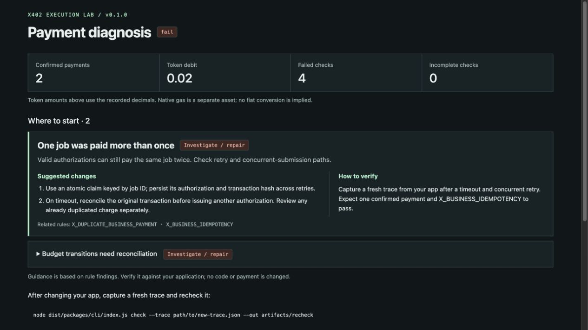

# x402 Execution Lab

**Reproduce payment failures. Find what to check and change.**

**English** · [中文指南](docs/README.zh-CN.md) · [MIT](LICENSE) · [CI](https://github.com/sunruize93-cmyk/x402-execution-lab/actions/workflows/ci.yml)

A local testing tool for x402 developers. Run payments with test tokens or inspect a saved trace to get findings, suggested changes, and verification steps.

A timed-out request can lead an app to pay for the same job twice. The lab groups related payment and budget findings, then points to integration checkpoints such as job idempotency, transaction reconciliation, and concurrent submissions.



_An actual local duplicate-payment run. Diagnosis comes first; complete checks and transaction details expand on demand._

## Try it

You need Node.js 22 or 24, npm, and macOS or Linux. The local test chain is managed automatically; no funded wallet is needed.

```sh
git clone https://github.com/sunruize93-cmyk/x402-execution-lab.git
cd x402-execution-lab
npm ci
npm run build

node dist/packages/cli/index.js run \
  --case duplicate-business-payment --driver local --out artifacts/duplicate
```

This case deliberately pays twice. **Expect `FAIL` and exit code `1`.** Open `artifacts/duplicate/report.html` in a browser, or run `open artifacts/duplicate/report.html` on macOS.

Start with **Suggested changes** and **How to verify**. `diagnostics.json` contains the same guidance, `findings.json` contains the individual checks, and `trace.json` retains the execution record.

For a timeout resolved with one payment, use `--case timeout-late-confirmation --out artifacts/timeout`; expect `PASS`. Add `--lang zh-CN` for a Chinese report.

## Diagnose a saved report

```sh
node dist/packages/cli/index.js diagnose \
  --input artifacts/duplicate/findings.json --out artifacts/diagnosis
```

Open `artifacts/diagnosis/report.html`. This command runs offline and sends no payment. Guidance comes from the triggered rules and needs review against your application's code; it does not automatically patch your app.

## Use your own trace

Map your application's quotes, authorizations, receipts, and business events to the [trace schema](packages/contracts/trace.schema.json), then run:

```sh
node dist/packages/cli/index.js check \
  --trace path/to/new-trace.json --out artifacts/recheck
```

Replace the placeholder with a fresh capture. After a code change, reproduce the failure and capture new evidence; rechecking an old trace or passing a built-in demo does not validate your fix. See the [integration guide](docs/adapters.md) for adapters, driver modes, and CI exit codes.

## Coverage and contributing

Includes 20 scripted scenarios and 8 local execution scenarios. Local runs use the x402 SDK, Anvil, and test tokens; application delivery is simulated. See [compatibility](docs/compatibility.md) for the tested scope.

- [Fees, settlement, and check semantics](docs/semantics.md)
- [Tests and contributions](CONTRIBUTING.md)
- [Report a reproducible issue](https://github.com/sunruize93-cmyk/x402-execution-lab/issues)

[MIT license](LICENSE) · [Third-party notices](NOTICE)
