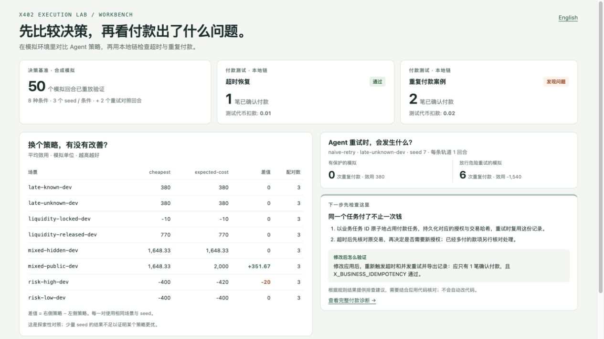
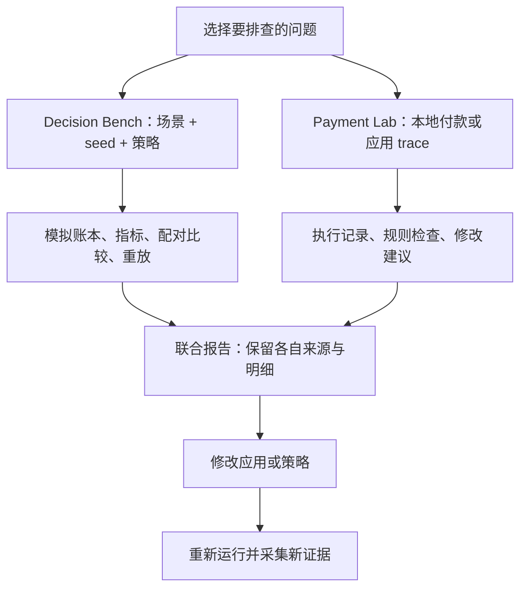

# x402 Execution Lab

**在 Agent 花真钱之前，先测清楚：该不该付、会不会付两遍、出错后该查哪里。**

**中文** · [English](README.en.md) · [快速上手](#快速上手) · [使用文档](#文档导航)

[](https://github.com/sunruize93-cmyk/x402-execution-lab/actions/workflows/ci.yml)
[](LICENSE)
[](bench/LICENSE)

x402 Execution Lab 是一个本地运行的 **Agent 支付测试工具箱**。它把付款决策模拟和 x402 执行诊断放在同一个项目里：先用模拟钱比较选择与重试策略，再用本地测试币检查付款流程，最后查看问题、修改建议和验证方法。

**内置演示不需要充值、用户私钥、GPU 或模型 API key。** 安装依赖后，演示使用本机模拟器和自动启动的临时测试链。



_运行下面的联合示例即可生成这类报告。策略指标来自模拟；付款检查来自本地测试链，两种结果分别标明来源。_

## 为什么需要它？

假设 Agent 调用一个收费 API，付完钱却没有收到响应。它该继续等、查询原交易，还是再付一次？如果换一个更便宜的服务，失败后的重试成本会不会更高？

这些问题横跨两个地方：**策略决定怎么花钱，支付集成决定钱实际怎么走。** 单看一笔交易成功，无法知道同一个业务任务是不是被付了两次；单看模拟里的高收益，也无法知道实际签名、费用和扣款是否对得上。

这个项目提供可复用的场景、账本和报告，让你把这些故障主动跑出来。适合接入 x402 的开发者、付费工具与自动采购 Agent 的开发者，以及需要可控策略实验的研究者。

## 合并后能做什么？

原来的 **Arena Execution Bench** 现在位于 `bench/`，与原有付款 Lab 共用仓库、文档入口和联合演示。两个模块也可以单独安装。

|          | Payment Lab · 付款执行与诊断                           | Decision Bench · 策略模拟与比较                               |
| -------- | ------------------------------------------------------ | ------------------------------------------------------------- |
| 主要问题 | 这次付款哪里不对，应该检查什么？                       | 在相同条件下，哪个决策更合适？                                |
| 运行方式 | TypeScript；离线记录检查或 x402 SDK + Anvil 本地链     | Python；离散事件模拟器与规则策略，可选模型接口                |
| 典型场景 | 超时后确认、重复付款、授权重用、费用漏记、预算提前释放 | 低价高风险、确认延迟、资金占用、混合采购                      |
| 现有覆盖 | 20 个脚本场景、8 个本地执行场景                        | 4 类场景；train/dev/eval 共 24 个条件，默认 dev 的 8 个       |
| 输出     | 中文/英文 HTML 诊断、规则结果、trace 与双重记账        | 净效用、重复付款、费用、资金占用等指标；配对比较与可重放轨迹  |
| 接入方式 | 把应用的报价、授权、回执与业务事件映射为 Lab trace     | 实现策略接口或 JSON 子进程接口，传入 observation，返回 action |

联合示例把两侧结果汇总到一个 HTML 入口。**策略模拟还不会直接驱动 x402 付款，两侧也保留各自的 trace 格式。** 你可以沿着同一个问题分别检查决策与执行，而不用把模拟数据误当作链上记录。

## 快速上手

完整演示需要 **Node.js 22 或 24、npm、Python 3.10–3.13，以及 macOS 或 Linux**。Anvil 随开发依赖安装，由本地执行器启动和关闭。

```sh
git clone https://github.com/sunruize93-cmyk/x402-execution-lab.git
cd x402-execution-lab

# 付款执行模块
npm ci
npm run build

# 策略模拟模块
python3 -m venv .venv
source .venv/bin/activate
python -m pip install -e './bench'

# 同时运行两个模块，生成中文汇总报告
npm run demo:combined -- --out artifacts/combined --lang zh-CN
```

用浏览器打开 `artifacts/combined/report.html`；macOS 可以运行：

```sh
open artifacts/combined/report.html
```

请为下一次运行指定新的输出目录，例如 `artifacts/combined-2`。如需指定 Python 解释器，追加 `--python /absolute/path/to/python`。下面命令均从仓库根目录运行。

只需要付款模块时，可跳过 Python 安装；只需要模拟器时，可直接安装 `./bench` 并使用 `aeb` 命令，不需要 Node.js 或测试链。Windows 可运行 Python 模拟器，虚拟环境用 `.venv\Scripts\Activate.ps1` 激活；完整联合演示和可选子进程适配器使用 macOS/Linux。

## 三种使用方式

### 1. 先看一个完整例子

上面的 `demo:combined` 会运行：

- **策略比较：**`cheapest` 与 `expected-cost` 使用相同的 8 个 dev 条件和 seed `0,1,2`，共 48 个模拟 episode，并生成配对比较。
- **重试诊断：**同一个 `naive-retry` 策略在 `late-unknown-dev`、seed `7` 下分别运行 `guarded` 和 `diagnostic`，共 2 个 episode，观察拦截危险重试的作用。
- **付款执行：**在本地链运行超时恢复与重复付款两个 x402 案例。前者预期 `PASS`；后者故意付款两次，预期 `FAIL`。

报告同时链接原始结果，`summary.json` 提供机器可读摘要。联合脚本会识别故意失败的案例，正常完成整套演示；它不会把这个 `FAIL` 改成通过。

模拟器的 `diagnostic` 只在合成环境中放宽新授权保护，用来暴露错误策略的后果；它仍检查预算，也不会操作真实钱包。

### 2. 排查自己的付款流程

先运行重复付款示例，熟悉报告：

```sh
npm run lab -- run --case duplicate-business-payment --driver local \
  --lang zh-CN --out artifacts/duplicate
```

**这个命令预期返回 `FAIL` 和退出码 `1`。** 打开 `artifacts/duplicate/report.html`，先看“建议检查与修改”和“修后怎么验证”。比如重复付款会提示检查业务任务 ID 的原子占用、超时后原交易核对，以及并发重试。

接入自己的应用时，将记录映射为 [Lab trace](packages/contracts/trace.schema.json)，再检查：

```sh
npm run lab -- check --trace path/to/new-trace.json \
  --lang zh-CN --out artifacts/app-check

# 已经有检查结果时，可以只重新生成诊断，无须再次付款
npm run lab -- diagnose --input artifacts/app-check/findings.json \
  --lang zh-CN --out artifacts/app-diagnosis
```

`path/to/new-trace.json` 是占位路径，请换成应用采集的新记录。标准 x402 v2 exact EVM 请求与 EIP-3009 授权已有 TypeScript 适配函数；原始服务商日志仍需做字段映射，见[接入指南](docs/adapters.md)。

| 文件               | 用来做什么                             |
| ------------------ | -------------------------------------- |
| `report.html`      | 阅读诊断；交易明细与完整规则按需展开   |
| `diagnostics.json` | 程序读取问题分组、修改检查点与验证步骤 |
| `findings.json`    | 查询逐条规则及其证据引用               |
| `trace.json`       | 保留输入/执行记录，供后续离线检查      |

诊断依据规则结果给出建议，不读取或自动修改你的业务代码。修复后，要重新触发原故障、采集新 trace 再检查；旧记录不会因为代码变了而更新。

### 3. 比较自己的 Agent 策略

先用两条内置策略建立可复现的对照：

```sh
npm run bench -- run --suite mechanism-v1 --policy cheapest \
  --seeds 0,1,2 --out artifacts/policies/cheap
npm run bench -- run --suite mechanism-v1 --policy expected-cost \
  --seeds 0,1,2 --out artifacts/policies/expected
npm run bench -- compare --runs artifacts/policies/cheap artifacts/policies/expected \
  --paired-by seed --out artifacts/policies/comparison

# 重算公开轨迹的指标，再核验保存的动作能否重现完整 episode
npm run bench -- replay \
  --trace artifacts/policies/cheap/episodes/late-unknown-dev--seed-0/events.jsonl
npm run bench -- verify \
  --episode artifacts/policies/cheap/episodes/late-unknown-dev--seed-0
```

查看 `artifacts/policies/comparison/report.md` 和 `comparison.json`。比较按**相同场景与 seed 的整个 episode**配对，展示效用差异与 bootstrap 区间，不把同一局里的多个任务当作独立样本。小样本适合验证机制，不能据此宣布某个模型普遍更强。

内置基线包括价格、速度、预期成本、贝叶斯与预算感知策略。你可以修改[场景 JSON](bench/src/aeb/data/scenarios)，或通过[Agent 接口](bench/docs/AGENT_INTERFACE.md)接入自己的策略/模型。模型调用是可选项，需要自行配置，并有调用数、token、时间和估算费用限制；默认示例不会调用模型。

## 架构与验证流程



- **Lab 的纯检查核心**不发网络请求、不签名、不移动资金。只有显式选择 `--driver local` 才会启动临时 Anvil、HTTP 402 服务与测试代币。
- **Bench 的世界与 Agent 观察分开。** Agent 只收到公开状态；评估记录保存隐藏状态，用于复现核验。金额使用整数账本，未知付款保留其资金占用。
- **合并保留边界。** 共享的是开发入口与工作流；跨模块的策略执行适配、trace 映射及生产接入仍需单独实现和验证。

## 怎么理解结果？

| 结果                | 可以说明什么                                         |
| ------------------- | ---------------------------------------------------- |
| Lab 本地 `PASS`     | 这次受支持的本地运行满足所选检查                     |
| Lab `FAIL`          | 至少一项规则失败；从诊断进入对应证据和修改检查点     |
| Lab `inconclusive`  | 证据或规则覆盖不足；缺少费用不能按零处理             |
| Bench 策略比较      | 在指定合成条件和 seed 下，两条策略的表现差异         |
| Bench `verify` 成功 | 保存的场景与动作可重现记录和指标，不需要重新调用模型 |

Lab 的 `check`/`run` 退出码为 `0` 满足策略、`1` 违规、`2` 证据不足、`3` 输入或执行错误。`diagnose` 成功生成建议时返回 `0`，不能用它代替 CI 中的 `check`。

本地付款路径为 **x402 v2 exact / EVM EOA / EIP-3009**，使用测试代币，业务交付为模拟。Bench 的费用、服务风险和效用均由合成场景定义。两者都不构成真实服务商评测、生产支付验收或 LLM 排行榜。公开 Arena 文件导出是对接材料，尚未接入 Arena 生产 API 或排行榜。完整细节见[Lab 兼容性](docs/compatibility.md)和[Bench 集成说明](bench/docs/INTEGRATION.md)。

## 文档导航

| 想做的事                       | 文档                                                                        |
| ------------------------------ | --------------------------------------------------------------------------- |
| 接入 x402 记录、理解命令与报告 | [Lab 接入指南](docs/adapters.md)                                            |
| 检查费用、授权、结算和预算规则 | [Lab 语义](docs/semantics.md) · [兼容性与场景矩阵](docs/compatibility.md)   |
| 理解模拟器账本、效用与公开证据 | [Bench 语义](bench/docs/SEMANTICS.md)                                       |
| 设计策略实验与配对分析         | [实验协议](bench/docs/EXPERIMENTS.md)                                       |
| 接入规则策略或模型             | [Agent 接口与调用限制](bench/docs/AGENT_INTERFACE.md)                       |
| 查看历史机制实验               | [168 个合成 episode 的既有复现记录](bench/artifacts/mechanism-v1/README.md) |
| 修改代码、运行测试             | [贡献指南](CONTRIBUTING.md)                                                 |

历史机制实验保留原运行来源；它不是本次联合示例新跑的 50 个模拟 episode。为改动增加测试时，请提交能复现问题的场景、seed 或脱敏 trace，而不只贴一张报错截图。

## 贡献与许可

欢迎[提交 issue](https://github.com/sunruize93-cmyk/x402-execution-lab/issues)，附上运行命令、预期行为和可复现记录。新增故障场景、改进诊断、适配应用记录都很有用。测试及代码组织见[贡献指南](CONTRIBUTING.md)。

| 范围                                          | 许可证                                                     |
| --------------------------------------------- | ---------------------------------------------------------- |
| 根目录 Payment Lab 与联合工具、原有文档/场景  | [MIT](LICENSE)                                             |
| `bench/` 导入的 Python 模块、文档、场景与轨迹 | [Apache-2.0](bench/LICENSE)，保留其 [NOTICE](bench/NOTICE) |
| 第三方依赖                                    | 保留各自许可证，见 [NOTICE](NOTICE)                        |

统一仓库后仍保留以上许可范围。发布记录或 HTML 报告前请先移除私钥、凭证及业务敏感数据；折叠明细只改变显示方式，不会从文件中删除内容。
