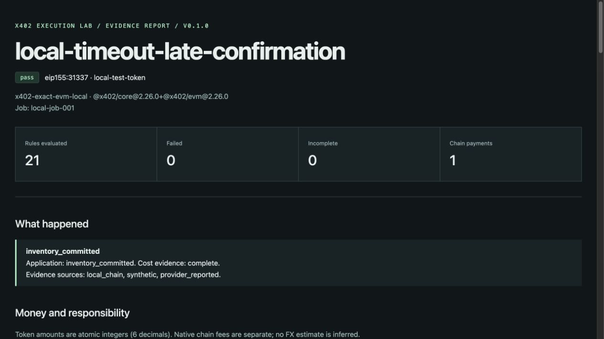
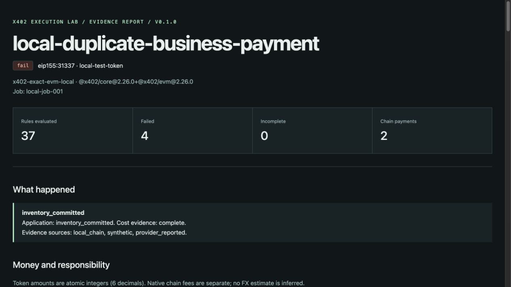
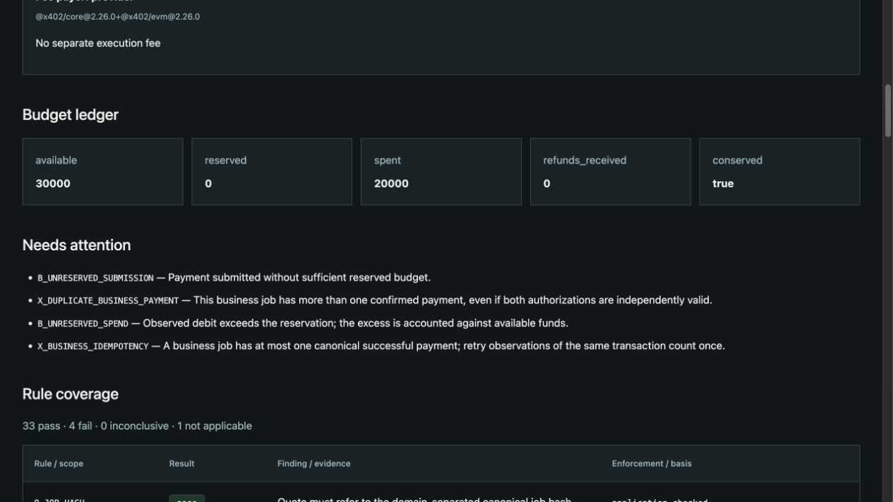

# x402 Execution Lab

**在本地复现 AI 支付故障，看清钱付了几次、费用由谁承担。**

[](https://github.com/sunruize93-cmyk/x402-execution-lab/actions/workflows/ci.yml)
[](../LICENSE)

**中文指南** · [English](../README.md) · [快速开始](#快速开始) · [读懂报告](#读懂报告) · [接入自己的项目](#接入自己的项目)

x402 Execution Lab 是面向开发者的**支付测试与故障复现工具**。它用测试币在你的电脑上运行付款流程，或者离线检查已有的付款记录，生成可阅读的 HTML 报告和可供程序处理的 JSON 结果。

比如：AI 付费调用一个 API，请求超时了，但钱已经转出。程序如果换一份授权再付一次，同一个任务就可能被扣款两次。这个工具让你把这种情况实际跑出来，看清问题发生在哪里。



_真实本地运行截图：请求超时后，核对原交易，最终只付款一次。使用临时链和测试代币；图中的业务交付是模拟的。_

## 为什么做这个工具？

[x402](https://x402.org/) 让软件在 HTTP 请求中完成付款。例如，AI Agent 可以自动付费调用数据 API。

接入时，开发者还需要回答一些具体问题：请求超时后怎么重试？同一份授权重复提交会怎样？链上付款成功了，服务交付是否也完成了？费用记录有没有把商户承担的成本算到用户头上？

我把这些问题做成可复现的测试场景，方便开发者从现成例子开始，再把自己应用的执行记录接进来。修复后重新运行同类检查，也能把失败记录和报告附在 issue 里，帮助其他人复现。

| 你正在做什么       | 可以怎样用它                                         |
| ------------------ | ---------------------------------------------------- |
| 第一次接入 x402    | 先跑通付款和超时案例，理解请求、授权、交易回执的关系 |
| 修改重试逻辑       | 用重复付款案例理解业务幂等，再检查自己应用导出的记录 |
| 排查金额或手续费   | 对照付款人扣款、商户入账和 Gas 费用，确认承担方      |
| 给项目增加回归检查 | 在 CI 中检查保存的 trace，用退出码和规则 ID 定位失败 |

## 快速开始

需要 **Node.js 22 或 24、npm，以及 macOS 或 Linux**。本地执行器会自动启动并关闭 Anvil 临时测试链，不需要给钱包充值或单独安装 Anvil。

### 1. 安装并构建

```sh
git clone https://github.com/sunruize93-cmyk/x402-execution-lab.git
cd x402-execution-lab
npm ci
npm run build
```

### 2. 运行“请求超时，但交易最终成功”

```sh
node dist/packages/cli/index.js run \
  --case timeout-late-confirmation --driver local --out artifacts/timeout
```

这会通过真实 x402 SDK 签名并提交测试交易，在广播后中断 HTTP 请求，再核对原来的交易结果。预期终端输出：

```text
PASS · local-timeout-late-confirmation
21 pass / 0 fail / 0 incomplete
inventory_committed · spent 10000 / reserved 0
artifacts/timeout/findings.json
artifacts/timeout/report.html
```

这里的 `inventory_committed` 是演示中的模拟交付状态。关键结果是 **Chain payments = 1**：没有因为请求超时而发起第二笔付款。

### 3. 打开报告

用浏览器打开 `artifacts/timeout/report.html`。也可以在项目目录运行适合自己系统的命令：

```sh
# macOS
open artifacts/timeout/report.html

# Linux 桌面
xdg-open artifacts/timeout/report.html
```

没有图形界面的服务器可以把整个输出目录下载到本机查看。报告是静态 HTML，不需要启动网站或登录账号。

| 生成的文件      | 用途                                   |
| --------------- | -------------------------------------- |
| `report.html`   | 在浏览器里看付款、费用和失败原因       |
| `findings.json` | 读取检查结果，接入 CI 或其他工具       |
| `trace.json`    | 保存本次执行记录，供离线复查或复现问题 |

## 再跑一个会报错的例子

```sh
node dist/packages/cli/index.js run \
  --case duplicate-business-payment --driver local --out artifacts/duplicate
```

这个例子故意用两份不同的有效授权，为同一个任务付款两次。**预期是 `FAIL`、退出码 `1`，而且报告仍会正常生成。** 这说明工具发现了故意制造的问题。



打开 `artifacts/duplicate/report.html`，向下找到 **Needs attention**。这里会指出重复付款和预算预留不足；其中 `X_BUSINESS_IDEMPOTENCY` 检查的是“一个业务任务最多成功付款一次”。

<details>
<summary>展开查看失败原因与预算明细截图</summary>



</details>

两份授权各自有效，仍可能造成业务上的重复付款。把两次请求关联到同一个任务，再核对原交易，是应用集成时需要考虑的部分；运行内置案例不会自动修改你的应用。

## 读懂报告

报告目前保留英文字段和规则 ID，便于与 JSON、代码和 issue 对照。按下面的顺序读即可：

| 页面字段                           | 中文含义与看法                                            |
| ---------------------------------- | --------------------------------------------------------- |
| `pass` / `fail` / `inconclusive`   | 已提供证据满足检查 / 检查发现问题 / 证据不足，无法确定    |
| `Chain payments`                   | 已确认的不同交易数量；先看有没有重复付款                  |
| `Failed` / `Incomplete`            | 失败与证据不足的检查数量；到 **Needs attention** 查看原因 |
| `Payer debit` / `Merchant credit`  | 付款人实际扣款 / 商户实际入账                             |
| `Native gas (wei)`                 | 链上执行消耗的原生币费用，与支付代币金额分开记录          |
| `available` / `reserved` / `spent` | 可用预算 / 预留预算 / 已花费预算                          |
| `Rule coverage`                    | 每一项检查的结果、证据引用和检查依据                      |

**金额采用最小单位整数。** 本地测试代币有 6 位小数，所以 `10000` 表示 `0.01` 个测试代币；重复付款后的 `20000` 表示 `0.02`。这些数字不是美元金额。Gas 使用另一种资产及单位，不能直接与代币金额相加。

`pass` 表示当前记录通过了适用检查；业务交付状态与链上确认分开记录。`inconclusive` 表示需要补充证据，例如缺少费用信息或无法确认合约执行约束。

## 选择合适的运行方式

| 方式                    | 适合什么情况                            | 执行范围                       |
| ----------------------- | --------------------------------------- | ------------------------------ |
| `run --driver local`    | 验证 SDK 签名、交易广播、回执和故障路径 | 在临时本地链上执行测试交易     |
| `run --driver scripted` | 快速了解规则、重现预设错误              | 读取内置合成记录，不启动区块链 |
| `check --trace ...`     | 复查自己的记录，接入回归测试            | 纯离线检查，不发送付款         |

提供 **20 个脚本场景**和 **8 个本地执行场景**，两者覆盖范围不同。`list` 列出脚本场景；本地执行支持 `success`、`timeout-late-confirmation`、`duplicate-business-payment`、`repeated-authorization`、`verify-then-revert`、`tampered-authorization`、`expired-authorization`、`cancelled-authorization`。

```sh
# 列出脚本场景
node dist/packages/cli/index.js list

# 离线运行超时场景
node dist/packages/cli/index.js run \
  --case timeout-late-confirmation --driver scripted \
  --allow-incomplete --out artifacts/scripted
```

脚本记录不能证明合约实际执行了约束，因此这个例子的报告会保留 `inconclusive`。`--allow-incomplete` 仅允许证据不足的结果以退出码 `0` 结束，方便演示；不会把报告改成 `pass`，也不会忽略真正的失败。

## 接入自己的项目

先用刚刚生成的记录试一次离线检查：

```sh
node dist/packages/cli/index.js check \
  --trace artifacts/timeout/trace.json --out artifacts/recheck
```

之后，把你应用的报价、授权、交易尝试、回执和业务状态映射到 [trace JSON Schema](../packages/contracts/trace.schema.json)，再用相同的 `check` 命令读取。可以从生成的 `trace.json` 或[示例记录](../examples/timeout.jsonl)理解结构。原始服务商日志需要适配，不能直接当作 trace 输入。

已有 TypeScript 适配函数可处理标准 x402 v2 exact EVM 的付款要求与 EIP-3009 授权，见 [SDK、CLI 与适配器文档（英文）](adapters.md)。当前尚未发布 npm 包，请从仓库构建，或通过 `npm pack` 生成本地安装包。

**CI 默认退出码：** `0` 满足检查策略；`1` 发现违规；`2` 证据或必需规则覆盖不足；`3` 输入或执行错误。可以用 `--require-rule` 指定必须通过的规则，详见[自动检查说明（英文）](adapters.md#cli-and-automated-checks)。

## 常见问题

- **重复付款例子运行失败了？** 如果得到 `FAIL` 和报告，这是预期结果。`x402-lab: ...` 加退出码 `3` 才需要检查命令、输入或运行环境。
- **本地场景提示 unsupported？** `local` 只支持上方列出的 8 个场景。其余脚本场景使用 `--driver scripted`。
- **为什么每次截图里的地址和 Gas 不一样？** 每次运行都新建临时账户和测试合约；比较检查结果、付款次数和金额即可。[截图复现说明](images/README.md)记录了本次示例。
- **能直接拿它验证生产支付吗？** v0.1 验证的是本地测试路径与输入记录的一致性。公共支付服务商、生产代币和实际交付需要另外验证；离线检查也不会主动到链上认证导入证据。

## 技术范围与贡献

当前本地执行路径是 **x402 v2 exact / EVM / EOA / EIP-3009**，使用 Anvil 临时链和专用测试合约；业务交付为模拟。技术细节见[兼容性与验收范围（英文）](compatibility.md)和[费用、结算与证据规则（英文）](semantics.md)。

```sh
npm run check       # Schema、类型、离线测试和构建
npm run test:local  # SDK + 本地链集成测试
```

欢迎[提 issue](https://github.com/sunruize93-cmyk/x402-execution-lab/issues)，附上运行命令、预期结果和已去除敏感信息的记录。贡献方法见 [CONTRIBUTING（英文）](../CONTRIBUTING.md)。

项目使用 [MIT 许可证](../LICENSE)，依赖库保留各自许可证，见 [NOTICE](../NOTICE)。
