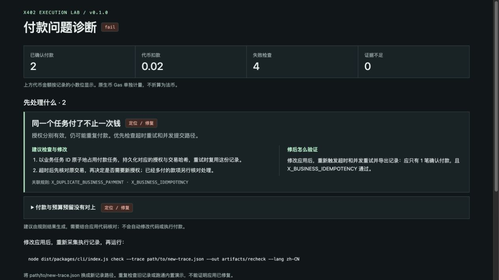

# x402 Execution Lab

**复现付款故障，找到该检查和修改的地方。**

[English](../README.md) · **中文** · [MIT](../LICENSE) · [CI](https://github.com/sunruize93-cmyk/x402-execution-lab/actions/workflows/ci.yml)

一个给 x402 开发者用的本地测试工具：用测试币运行付款流程，或离线检查已有记录，输出问题、修复检查点和验证方法。

例如，请求超时后重新付款，可能让同一个任务被扣款两次。Lab 会把重复付款及相关预算告警整理成问题卡片，提示你检查任务幂等、原交易核对和并发提交逻辑。



_本地重复付款案例的真实报告。首屏显示诊断，完整规则和交易明细按需展开。_

## 先跑一个例子

需要 Node.js 22 或 24、npm，以及 macOS 或 Linux。本地测试链由工具自动管理，不需要钱包充值。

```sh
git clone https://github.com/sunruize93-cmyk/x402-execution-lab.git
cd x402-execution-lab
npm ci
npm run build

node dist/packages/cli/index.js run \
  --case duplicate-business-payment --driver local \
  --lang zh-CN --out artifacts/duplicate
```

这里故意付款两次，**预期输出 `FAIL`，退出码为 `1`**。用浏览器打开 `artifacts/duplicate/report.html`；macOS 也可以运行 `open artifacts/duplicate/report.html`。

报告先显示“建议检查与修改”和“修后怎么验证”。`diagnostics.json` 保存同样的建议，`findings.json` 保存逐条检查结果，`trace.json` 保存执行记录。

想看超时后只付一次的正常处理路径，把场景名改成 `timeout-late-confirmation`，输出目录改成 `artifacts/timeout`；预期为 `PASS`。

## 已有报告，直接看诊断

```sh
node dist/packages/cli/index.js diagnose \
  --input artifacts/duplicate/findings.json \
  --lang zh-CN --out artifacts/diagnosis
```

打开 `artifacts/diagnosis/report.html`。此命令纯离线运行，不发送付款。建议根据触发的规则生成，需要结合你的应用代码核对；不会自动修复代码。

## 接入自己的项目

将应用的报价、授权、交易回执和业务状态映射为 [trace 格式](../packages/contracts/trace.schema.json)，再运行：

```sh
node dist/packages/cli/index.js check \
  --trace path/to/new-trace.json --lang zh-CN --out artifacts/recheck
```

把示例路径替换成自己的新记录。修复后要重新触发原来的故障并采集记录；重跑旧记录或跑通内置案例，不能验证应用是否修好。字段适配、运行方式和 CI 退出码见[接入指南](adapters.md)。

## 范围与文档

提供 20 个脚本场景、8 个本地执行场景。本地使用 x402 SDK、Anvil 和测试代币，业务交付为模拟。支持范围见[兼容性清单](compatibility.md)。

- [费用、结算与检查规则](semantics.md)
- [测试与贡献](../CONTRIBUTING.md)
- [提交可复现问题](https://github.com/sunruize93-cmyk/x402-execution-lab/issues)

[MIT 许可证](../LICENSE) · [第三方许可](../NOTICE)
